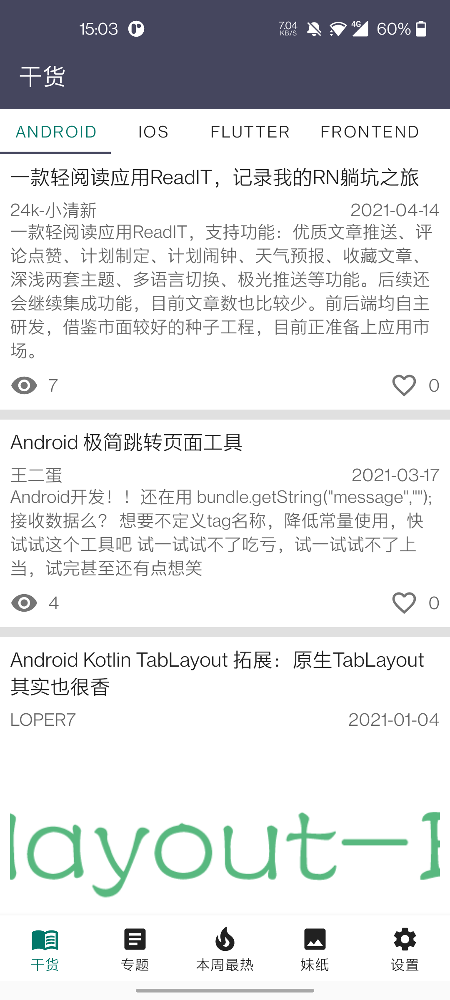
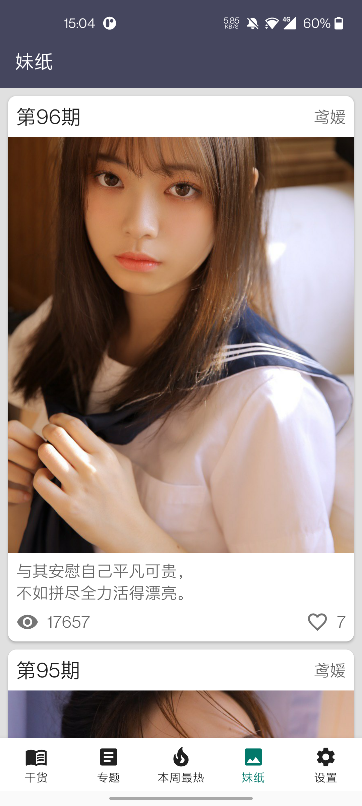
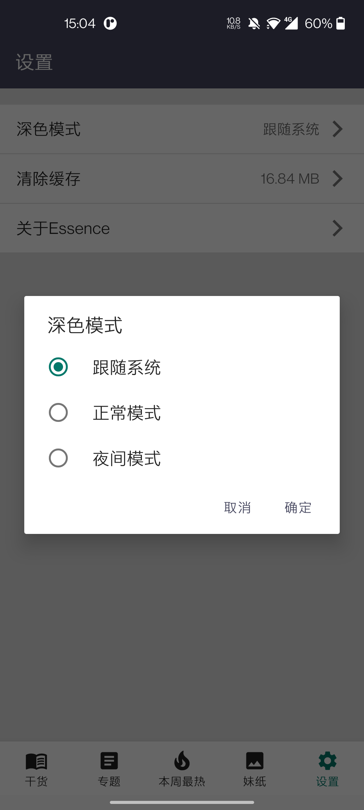
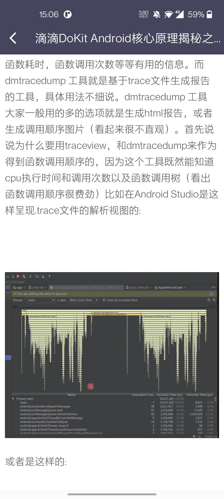
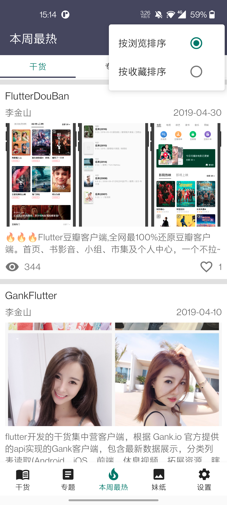
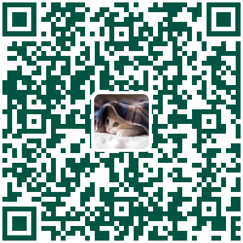

# Essence

**Essence**是一款使用[干货集中营](https://gank.io)提供的API所开发的APP，它使用**Kotlin**语言开发，网络请求使用**协程+retrofit**，代码架构使用当前最流行的**MVVM**架构。本项目采用开源的方式，目的是为了帮助更多的初学者来了解`Kotlin`语言以及`MVVM`架构。

## 预览

|  |  |  |
|:----:|:----:|:----:|
| 干货 | 妹子 | 设置 |

|  |  |  |
| :-----------------------------------: | :-----------------------------------: | :-----------------------------------: |
|               妹子详情                |               文章详情                |               本周最热                |

## 下载

|  |
|:----:|
| [下载](./download/app-release.apk?raw=true) |

## Licensed

  Copyright 2016-2021 Sachil

  Licensed under the Apache License, Version 2.0 (the "License");
  you may not use this file except in compliance with the License.
  You may obtain a copy of the License at

      http://www.apache.org/licenses/LICENSE-2.0

  Unless required by applicable law or agreed to in writing, software
  distributed under the License is distributed on an "AS IS" BASIS,
  WITHOUT WARRANTIES OR CONDITIONS OF ANY KIND, either express or implied.
  See the License for the specific language governing permissions and
  limitations under the License.

